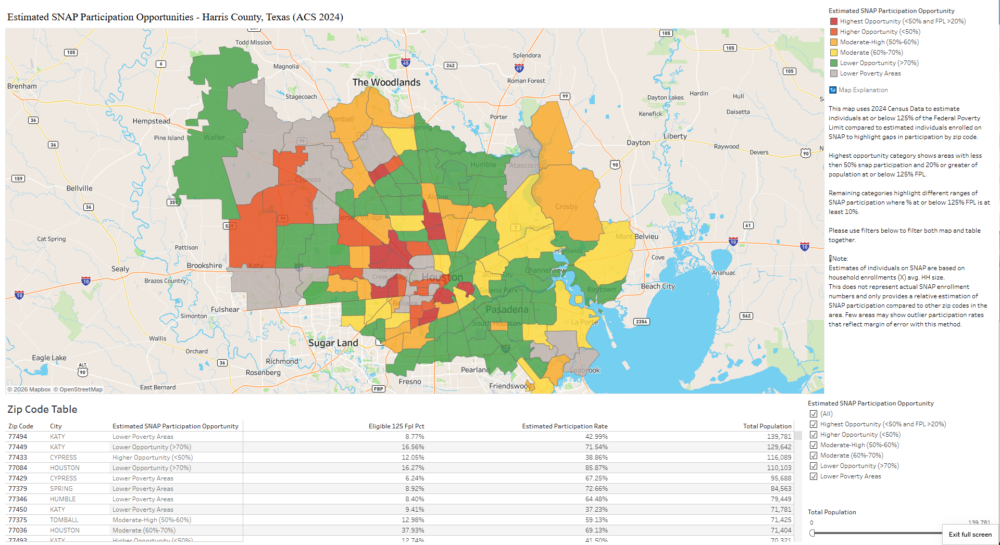

# Harris County SNAP Participation Opportunity Analysis
> Identifying communities with high SNAP eligibility and lower estimated participation across Harris County.

## 🎯 Project Overview
This project analyzes potential SNAP participation opportunities using 2024 American Community Survey (ACS) data, HUD USPS Zip Code Crosswalks, and open data sources. The analysis estimates the population below 125% of the Federal Poverty Level and compares it to estimated SNAP participants to identify geographic areas with the largest opportunity gaps.

## 📊 Key Findings
### 💻 130+ Zip Codes
Analyzed in Harris County
### 📉 Two Major Opportunity Areas
North-Northwest Houston and
South-Southwest Houston
### 📈 Many high-need areas
Already show 60% + estimated participation
### 🔍 Targeted Outreach
Can focus where participation appears lowest

*Right click link below to open dashboard in new window"
https://public.tableau.com/app/profile/justin.chacko/viz/HarrisCountySNAPGapAnalysis/HeatMap

## 🛠️ Methodology

### 📊 Data Pipeline Flow
`ACS C17002` ➡️ `ACS S2201` ➡️ `ACS B25010` ➡️ `HUD Zip Crosswalk` ➡️ `County Assignment` ➡️ `BigQuery` ➡️ `Analysis`

---

### 📝 Key Steps

* **Dataset Integration**
  * The **ACS tables** listed above were imported into **BigQuery** to create a snap gap table.
  * This integration is based on 3 data metrics: **population below 125% FPL**, **households receiving SNAP benefits**, and **average household size**.

* **Geographic Mapping**
  * The **HUD ZIP code crosswalk** and census county lookup tables were imported into **BigQuery** and added to snap gap table to accurately map the underlying ACS ZIP code data.

* **Dashboard & Analysis**
  * Final analysis on program **participation rates** compared to the estimated **eligible population** was successfully mapped onto an interactive **Tableau dashboard**.

